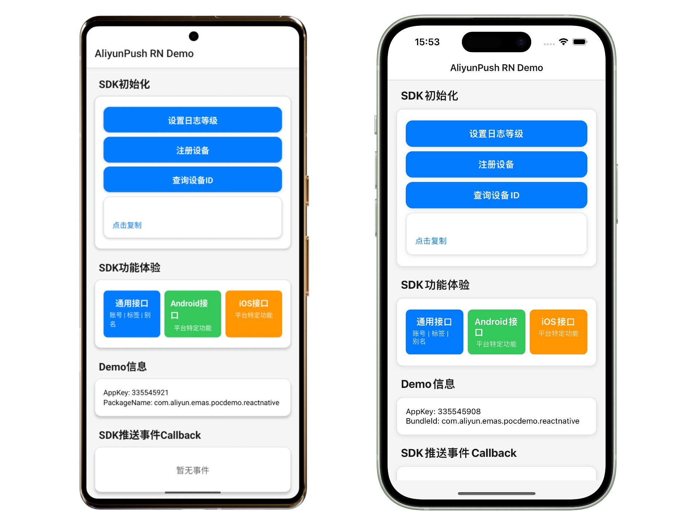

# Aliyun React Native Push Example



这是一个使用 [`@react-native-community/cli`](https://github.com/react-native-community/cli) 初始化创建的新 [**React Native**](https://reactnative.dev) 项目。

## 快速入门

> **注意**：在开始之前，请确保您已完成 [环境配置](https://reactnative.dev/docs/set-up-your-environment)。

### 步骤 1：启动 Metro

首先，您需要运行 **Metro**，这是 React Native 的 JavaScript 构建工具。

在项目根目录下运行以下命令以启动 Metro 开发服务器：

```sh
# 推荐使用 Yarn
yarn start

# 或者使用 npm
npm start
```

如果需要指定端口运行 Metro（例如使用 8082 端口），可在 `package.json` 中定义脚本或直接运行：

```sh
# 推荐使用 Yarn
yarn start --port=8082

# 或者使用 npm
npm start --port=8082
```

### 步骤 2：构建并运行您的应用

Metro 运行后，在项目根目录下打开一个新的终端窗口/面板，并使用以下命令之一来构建并运行您的 Android 或 iOS 应用：

#### Android

```sh
# 推荐使用 Yarn
yarn android

# 或者使用 npm
npm run android
```

若要指定模拟器和端口（例如使用 `emulator-5554` 和 8082 端口），可参考 `package.json` 中的脚本运行：

```sh
# 推荐使用 Yarn
yarn android:5554

# 或者使用 npm
npm run android:5554
```

#### iOS

对于 iOS 项目，需先安装 CocoaPods 依赖（仅在首次克隆项目或更新原生依赖时需要）。

首次创建新项目时，运行 Ruby bundler 以安装 CocoaPods：

```sh
bundle install
```

每次更新原生依赖后，运行：

```sh
bundle exec pod install
```

更多信息，请参阅 [CocoaPods 入门指南](https://guides.cocoapods.org/using/getting-started.html)。

```sh
# 推荐使用 Yarn
yarn ios

# 或者使用 npm
npm run ios
```

若要指定模拟器和端口（例如使用 `iPhone 15` 模拟器和 8082 端口），可参考 `package.json` 中的脚本运行：

```sh
# 推荐使用 Yarn
yarn ios:15

# 或者使用 npm
npm run ios:15
```

如果一切配置正确，您应该能在 Android 模拟器、iOS 模拟器或连接的设备上看到应用运行。

您也可以直接通过 Android Studio 或 Xcode 构建和运行应用。

### 步骤 3：修改您的应用

成功运行应用后，让我们来修改它！

在您喜欢的文本编辑器中打开 `App.tsx` 并进行一些更改。保存后，应用将自动更新以反映这些更改，这是由 [Fast Refresh](https://reactnative.dev/docs/fast-refresh) 功能实现的。

如果需要强制重新加载（例如重置应用状态），可以执行以下操作：

- **Android**：按两次 <kbd>R</kbd> 键，或通过 <kbd>Ctrl</kbd> + <kbd>M</kbd>（Windows/Linux）或 <kbd>Cmd ⌘</kbd> + <kbd>M</kbd>（macOS）打开 **开发菜单**，选择 **"Reload"**。
- **iOS**：在 iOS 模拟器中按 <kbd>R</kbd> 键。

## 恭喜！ :tada:

您已成功运行并修改了您的 React Native 应用！ :partying_face:

### 下一步？

- 如果您想将 React Native 代码集成到现有应用中，请查看 [集成指南](https://reactnative.dev/docs/integration-with-existing-apps)。
- 如果您想深入了解 React Native，请查看 [官方文档](https://reactnative.dev/docs/getting-started)。

## 故障排查

如果您在上述步骤中遇到问题，请参阅 [故障排查](https://reactnative.dev/docs/troubleshooting) 页面。

## 了解更多

要深入了解 React Native，请查看以下资源：

- [React Native 官网](https://reactnative.dev) - 了解更多关于 React Native 的信息。
- [入门指南](https://reactnative.dev/docs/environment-setup) - React Native 概览及环境配置说明。
- [基础知识](https://reactnative.dev/docs/getting-started) - React Native 基础知识的引导教程。
- [博客](https://reactnative.dev/blog) - 阅读最新的官方 React Native 博客文章。
- [`@facebook/react-native`](https://github.com/facebook/react-native) - React Native 的开源 GitHub 仓库。
